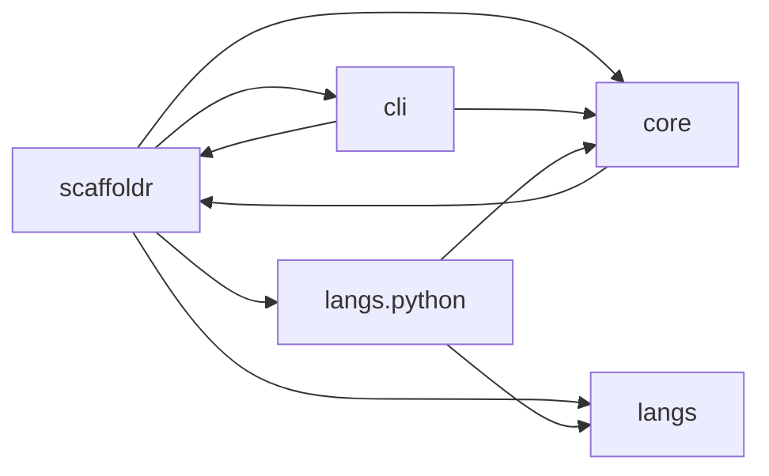

# scaffoldr

Structural analysis tool that produces compressed codebase maps for LLM consumption.

## Why

LLMs need structural context to understand codebases, but context windows are finite. Dumping raw source wastes tokens on implementation details that don't help an LLM reason about architecture. What matters is the shape: which modules exist, how they relate, where the boundaries are.

Traditional call graphs make this worse. They show every internal call, burying the architectural signal under thousands of edges that say "this helper calls that helper." The interesting calls are the ones that *cross module boundaries* -- where `train` reaches into `algorithms`, where `cli` depends on `config`. These cross-boundary calls reveal the coupling structure: which modules are tightly bound, which are isolated, and where the actual facades are.

scaffoldr discovers workspace structure, parses source code via language-specific plugins, and produces seven compressed artifacts that capture the structural signal an LLM needs -- under 500 tokens for the summary view.

## Plugin architecture

scaffoldr separates concerns into three layers:

- **`cli/`** -- argument parsing (`parser.py`) and file writing / progress output (`output.py`). The CLI gateway knows about flags, paths, and OS encoding, but nothing about languages or graph algorithms.
- **`core/`** -- graph algorithms (dependency graphs, class hierarchies, cross-boundary call analysis), output formatters (text, Mermaid, JSON, TOON), and the shared type contract (`AnalysisResult`). Core never imports from `langs/` or `cli/`.
- **`langs/`** -- language-specific plugins that handle workspace discovery, source parsing, and import resolution. Each plugin implements `analyze(workspace_root: Path) -> AnalysisResult`.

`__main__.py` is pure wiring: `cli/parser` → `langs/` → `core/graphs` → `cli/output`. It contains no argparse, no file writing, and no print statements (except error exits).

The `AnalysisResult` type is the boundary between `langs/` and `core/`. The `AnalyzeCommand` TypedDict is the boundary between `cli/parser` and `__main__`. Adding a language means implementing `analyze()` in `langs/your_language/`, adding detection logic to `langs/__init__.py`, and adding a dispatch case in `__main__.py`. The core algorithms and CLI layer work unchanged.

## Supported languages

| Language | Status |
|----------|--------|
| Python | Shipping (stdlib `ast` + `tomllib`, zero external dependencies) |
| TypeScript | Planned |
| Rust | Planned |
| Scala | Planned |
| Haskell | Planned |
| Nix | Planned |

## Output artifacts

| File | Format | What it reveals |
|------|--------|-----------------|
| `structure_summary.txt` | Text | All four views compressed into a single file (~450 tokens) |
| `dependencies.md` | Mermaid + text | Package-level dependency graph with directed edges |
| `class_hierarchy.txt` | Indented tree | Inheritance tree with method counts and key methods |
| `entry_points.txt` | Text | CLI entry points with their call chains and imports |
| `coupling_density.txt` | Text | ELD view: only calls that cross module boundaries |
| `facade_leaks.txt` | Text | Imports that bypass package facades |
| `structure_full.json` | JSON | Complete structured data for programmatic consumption |
| `structure_full.toon` | TOON | Token-optimized notation: YAML structure + CSV density |

The output format is the same regardless of source language -- core formatters operate on `AnalysisResult`, not on language-specific ASTs.

## Installation

```bash
# From the scaffoldr directory:
pip install -e .
# or
uv pip install -e .
```

## Quick start

```bash
scaffoldr analyze ./my-workspace --full
```

`python -m scaffoldr analyze ...` also works.

| Flag | Effect |
|------|--------|
| `--full` | Write all artifacts (JSON, TOON, and text) |
| `--json` | Write JSON only, skip text outputs |
| `--toon` | Write TOON format alongside text outputs |
| `--output-dir DIR` | Output directory (default: `.scaffoldr/`) |

The workspace argument points to a project root. Language detection is automatic -- scaffoldr identifies the language from workspace metadata (e.g. `pyproject.toml` for Python, `package.json` for TypeScript) and dispatches to the appropriate plugin.

## Key ideas

- **Language-agnostic core** -- graph algorithms and formatters work on any language's `AnalysisResult`
- **Plugin-based parsing** -- each language plugin handles workspace discovery, source parsing, and import resolution independently
- **ELD-oriented cross-boundary call graph** -- filters to only the calls that cross subpackage boundaries, sorted by coupling density
- **Multi-format output** -- text summaries for LLM context, Mermaid for visual graphs, JSON for tooling, TOON for token-efficient structured data

## Output examples

Real output from scaffoldr analyzing itself (a 13-module Python project):

### Dependency graph (Mermaid)



### Class hierarchy

```
# Class Hierarchy (7 classes)

+- CallCollector(ast.NodeVisitor) @ core.graphs (2m) [__init__, visit_Call]
+- FunctionCollector(ast.NodeVisitor) @ langs.python.parsing (3m) [__init__, visit_FunctionDef, visit_AsyncFunctionDef]
+- ImportCollector(ast.NodeVisitor) @ langs.python.parsing (3m) [__init__, visit_Import, visit_ImportFrom]
```

### Cross-boundary calls (ELD)

This is the most distinctive output. Instead of showing every internal call, it surfaces only the 24 that cross subpackage boundaries:

```
# Cross-Boundary Calls (ELD) — 24 calls across 7 boundary pairs

## scaffoldr.cli -> scaffoldr.core (7 calls)
  _write_toon -> format_toon
  _write_text_files -> format_coupling_density_text
  _write_text_files -> format_dependency_text
  _write_text_files -> format_class_tree_text
  _write_text_files -> format_facade_leaks_text
  _write_text_files -> format_dependency_mermaid
  _write_text_files -> format_entry_points_text

## scaffoldr -> scaffoldr.core (6 calls)
  _analyze -> generate_coupling_density
  _analyze -> generate_dependency_graph
  _analyze -> generate_entry_point_map
  _analyze -> generate_facade_leaks
  _analyze -> generate_class_hierarchy
  _analyze -> build_facade_exports
```

Reading this tells you: `cli` calls into `core` for all formatting (7 calls), while `__main__` orchestrates the core graph algorithms (6 calls). The coupling shape is clean: higher layers depend on lower layers, never the reverse.

### TOON format

Token-Oriented Object Notation -- YAML-like nesting for structure, CSV-like density for uniform arrays:

```
metadata:
  total_modules: 13
  parsed_modules: 13
  parse_errors: 0

dependency_graph:
  package_level:
    scaffoldr[4]: scaffoldr.cli,scaffoldr.core,scaffoldr.langs,scaffoldr.langs.python
    scaffoldr.cli[2]: scaffoldr,scaffoldr.core
    scaffoldr.core[1]: scaffoldr
    scaffoldr.langs.python[2]: scaffoldr.core,scaffoldr.langs

class_hierarchy:
  total_classes: 7
  classes[7]{depth,name,module,bases,method_count,key_methods}:
    0,CallCollector,core.graphs,ast.NodeVisitor,2,"__init__,visit_Call"
    0,FunctionCollector,langs.python.parsing,ast.NodeVisitor,3,"__init__,visit_FunctionDef,visit_AsyncFunctionDef"
```

## Architecture

```
scaffoldr/
├── pyproject.toml
├── src/scaffoldr/
│   ├── cli/                     # CLI gateway
│   │   ├── parser.py            #   Argument parsing, AnalyzeCommand type
│   │   └── output.py            #   File writing, progress, OS encoding
│   │                            #
│   │                            # ── AnalyzeCommand ──
│   │                            #
│   ├── core/                    # Language-agnostic
│   │   ├── types.py             #   AnalysisResult, ModuleAnalysis
│   │   ├── graphs.py            #   Dependency graph, class hierarchy, ELD
│   │   └── formatters.py        #   Text, Mermaid, JSON, TOON formatters
│   │                            #
│   │                            # ── AnalysisResult ──
│   │                            #
│   ├── langs/                   # Language-specific plugins
│   │   ├── __init__.py          #   detect_language() dispatcher
│   │   └── python/              #   Python plugin
│   │       ├── __init__.py      #     analyze() entry point
│   │       ├── discovery.py     #     pyproject.toml workspace/package/entry-point discovery
│   │       └── parsing.py       #     AST visitors: imports, classes, functions
│   └── __main__.py              # Wiring: cli → langs → core → output
```

Data flow: `cli/parser` → `__main__` → `langs/` → `AnalysisResult` → `core/graphs` → `cli/output`

`core/` never imports from `langs/` or `cli/`. `cli/output` imports from `core/formatters` (rendering) but not from `langs/`. Language plugins never import from each other.

## ELD: why cross-boundary calls matter

At every scale, a codebase decomposes into opaque units with contracts -- modules, packages, classes. The calls *within* a module are implementation details: they tell you how the module works internally. The calls that *cross* module boundaries tell you how modules relate -- which ones are coupled, which are isolated, where the facades are.

scaffoldr's cross-boundary call analysis operates at the subpackage level. For each function and method, it resolves call targets through import analysis, then filters to only calls where the source subpackage differs from the target subpackage. The result is sorted by coupling density (most-coupled boundary pairs first), giving you an immediate read on the architecture's coupling shape.

This is the ELD (Effective Local Decomposition) view: at the current resolution, what are the opaque units and how do they interact through their contracts?

## Requirements

Python 3.11+ (scaffoldr is written in Python; analyzed codebases can be any supported language).

No external dependencies -- the Python plugin uses only stdlib modules (`ast`, `tomllib`).
